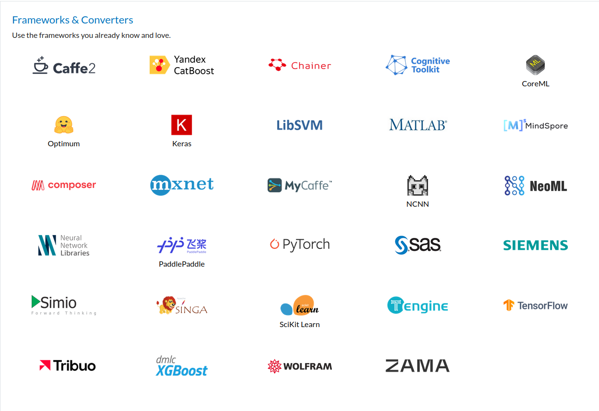

<!-- _class: lead -->

# Best Practices

---

# Think of that

You have a project to deploy.

Data Scientist : "I've train my classification model with a SVM on scikit-learn, it's good we're ready to ship."

---

# Think of that

3 weeks later.

Data Scientist : "The last model was crap ! Now I've used XGBosst, Gradient Boosted Tree for the win !."

---

# Think of that

6 weeks later

Data Scientist : "You know what ? I think I really love Multi Layer Perceptrons for classification method. This iteration is great."

---

Each time, you have to rewrite the inference module.

---

# ONNX to the rescue

[ONNX](https://onnx.ai/) stands for **Open Neural Network Exchange**. It's an open format for representing machine learning models. Think of it as a universal language that allows different AI frameworks to "talk" to each other.

---

* **Open Format**: ONNX isn't tied to a specific company or software. It's a community-driven standard, which means it's constantly evolving and improving.
* **Representing Machine Learning Models**: Machine learning models are complex structures with layers of interconnected nodes. ONNX provides a way to describe these structures in a standardized way, regardless of how the model was originally built.

We can even see them using [Netron](https://netron.app/).

---

* **Interoperability**: This is the key benefit. ONNX makes it possible to:
    * Train a model in one framework (like TensorFlow or PyTorch) and then use it in another (like Caffe2 or MXNet). This gives developers more flexibility and choice.
    * Deploy models on different hardware platforms (CPUs, GPUs, mobile devices) without needing to rewrite the model for each one.

---

---

# OCI artifact

The **Open Container Initiative** (OCI) is a project that aims to standardize container formats and runtimes. One of the key aspects of this standardization is the concept of an **OCI artifact**.

**What is an OCI artifact?**
At its core, an OCI artifact is any file or collection of files that can be stored and managed within an OCI-compliant registry. While container images are the most common type of OCI artifact, the specification is designed to be flexible enough to accommodate a wide range of other content types.

---

# Why are OCI artifacts important?

* **Standardization**: They provide a consistent way to package and distribute various types of software components, regardless of the tools or platforms used to create them.
* **Interoperability**: OCI artifacts can be easily shared and used across different environments, promoting collaboration and simplifying deployment workflows.
* **Security**: OCI registries offer built-in mechanisms for managing access control and ensuring the integrity of artifacts, enhancing the security of the software supply chain.

---

# Examples of OCI artifacts:

* **Container images**: These are the most common type of OCI artifact, containing the necessary files and instructions to run an application in a container.
* **Software Bill of Materials (SBOMs)**: These documents provide a list of all the components included in a software application, helping to track dependencies and identify potential vulnerabilities.
* **Machine Learning models**.
* [OCI as a Standard for ML Artifact Storage & Retrieval](https://static.sched.com/hosted_files/kccnceu2024/57/OCI%20ML%20Storage%20Standard%20%281%29.pdf)

---

Tools like `oras` and `cosign` can be used to interact with OCI registries and manage OCI artifacts. For example, you can use `oras` to push a Helm chart to a registry or pull an SBOM from a registry.

---

[ORAS](https://oras.land/) (OCI Registry As Storage) is a command-line tool that allows you to work with OCI artifacts. It's like a specialized tool for managing different kinds of files and data within an OCI-compliant registry.

**What it does**:

* **Manages OCI artifacts**: ORAS is designed to handle various types of content beyond just container images. This includes things like Helm charts, Software Bill of Materials (SBOMs), and other kinds of software-related files.

---

* **Interacts with OCI registries**: It allows you to push (upload) and pull (download) these artifacts to and from OCI-compliant registries, which are like central storage locations for these files.
* **Provides a command-line interface**: ORAS offers a set of commands that you can use in your terminal or scripts to perform actions like uploading, downloading, and managing your artifacts.

---

**Why it's useful**:

* **Standardized management**: ORAS helps to standardize how you handle different types of software components, making it easier to manage them consistently across different projects and environments.
* **Flexibility**: It allows you to store and manage a wide range of artifacts in a single registry, simplifying your workflow and reducing the need for multiple specialized tools.
* **Improved collaboration**: By providing a common way to manage artifacts, ORAS makes it easier for teams to share and collaborate on software projects.

---

# SBOM

An SBOM, or **Software Bill of Materials**, is essentially a detailed list of all the components that make up a piece of software.  Think of it like an ingredient list for a recipe, but for software. It identifies all the software packages, libraries, and other dependencies that are included in a given application.

---

# What it contains

An SBOM typically includes information about each component, such as:
* Name and version: The specific name and version of the software component.
* Supplier: Who created or maintains the component.
* License: The licensing terms governing the use of the component.
* Hashes: Cryptographic hashes that can be used to verify the integrity of the component.

---

# Why it's important 1/2

SBOMs are becoming increasingly crucial for software security and supply chain management for several reasons:

* **Vulnerability management**: By knowing what components are in your software, you can quickly identify if any of them have known vulnerabilities. This allows you to prioritize patching and reduce your risk of attack.
* **License compliance**: SBOMs help you understand the licensing obligations associated with the software you use. This is important for avoiding legal issues.

---

# Why it's important 2/2

* **Supply chain transparency**: SBOMs provide visibility into the software supply chain, making it easier to track the origin of components and identify potential risks.
* **Improved security posture**: Having an SBOM allows organizations to proactively manage their software risk and respond more effectively to security incidents.

There are standard formats for SBOMs, like **SPDX** (Software Package Data Exchange) and **CycloneDX**, which make it easier to share and process SBOM data.

---

# Syft & Grype

* [Syft](https://github.com/anchore/syft) is a command-line tool and Go library that helps you generate a Software Bill of Materials (SBOM) for your software.

* [Grype](https://github.com/anchore/grype) is an open-source vulnerability scanner for container images and filesystems. It helps you find known CVEs in the software that you're using. CVE stands for **Common Vulnerabilities and Exposures**. It's like a universal naming system for publicly disclosed security flaws in software.
